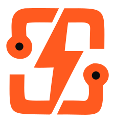
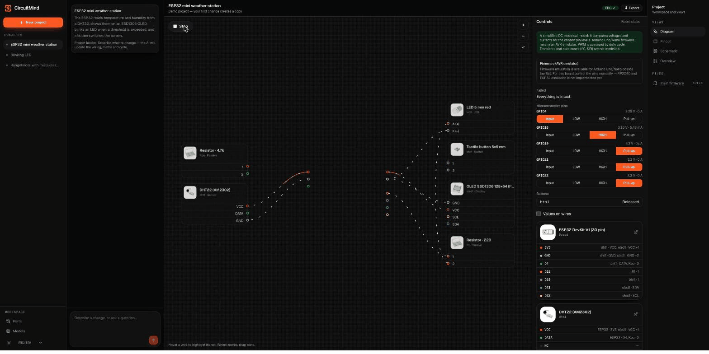
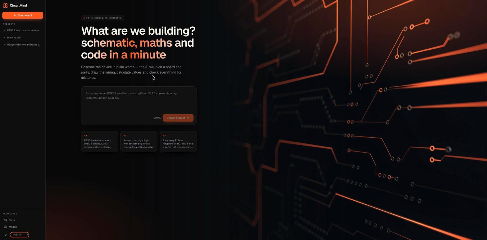
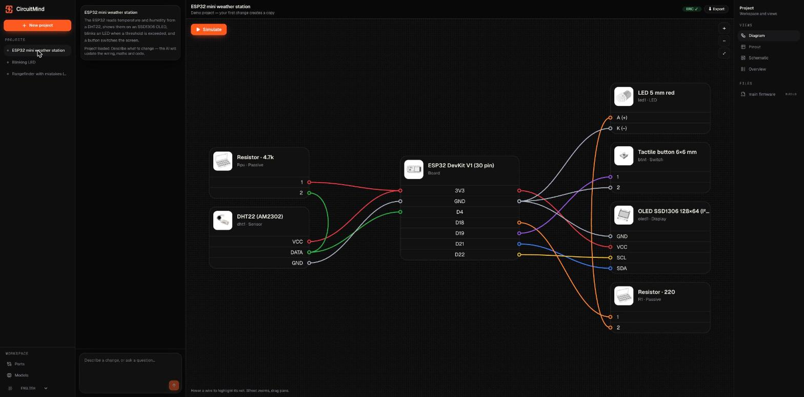
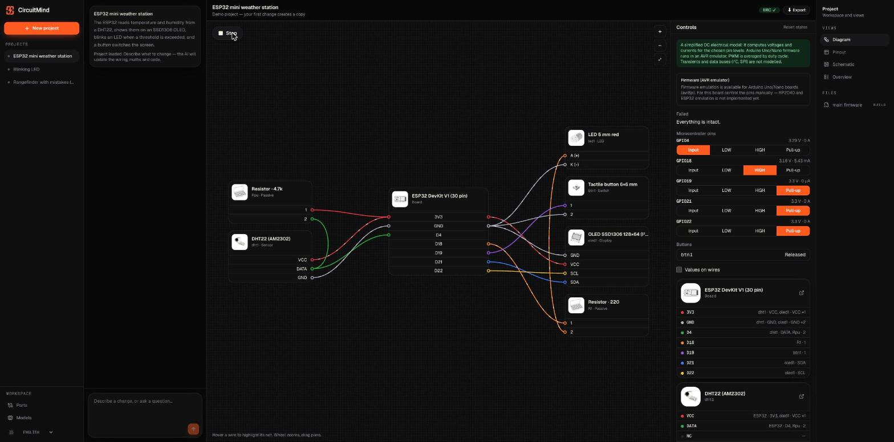
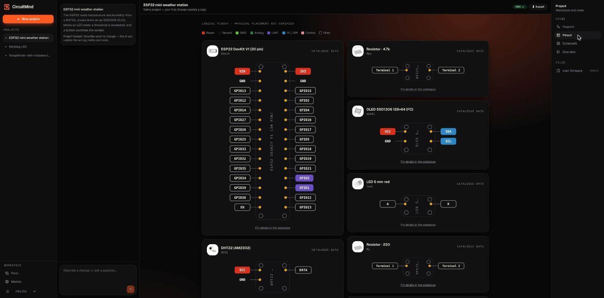
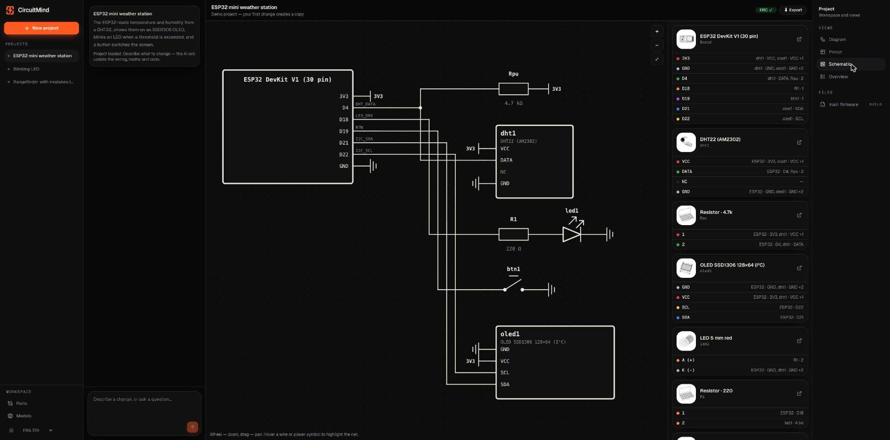
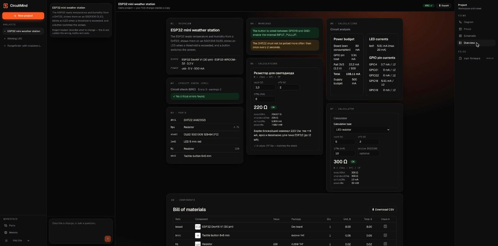
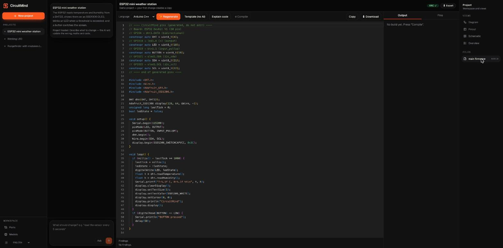
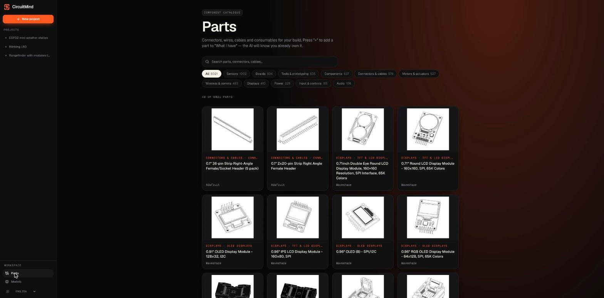

<div align="center">



# CircuitMind

### ИИ-конструктор электроники

Опишите устройство словами — ИИ подберёт плату и детали, нарисует подключение, посчитает номиналы,<br/>
проверит ошибки и напишет прошивку.

<p>
  
  
  
  
  
</p>



<sub>Запись реальной сессии: диаграмма → симуляция → распиновка → схема → обзор → прошивка.</sub>

<p><a href="README.md">English version</a></p>

</div>

---

## Чем это отличается

Если попросить чат-бота «подключи ESP32 к DHT22 и OLED», получится абзац текста, в котором электрика может быть неверной.
CircuitMind заставляет модель **сдавать проверяемый проект**:

- ИИ **никогда не рисует SVG**. Он возвращает **JSON через tool use**; он проходит Zod-валидацию и детерминированную
  **проверку электрических правил (ERC, 40 правил)**: 5 В на 3,3-вольтовый пин, светодиод без резистора, нет защитного диода, ADC2 при Wi-Fi…
  При ошибках проект возвращается на исправление (до 3 раз) и только потом рисуется нашим движком.
- Платы и детали берутся из **локальной библиотеки** по id — выдумать пины модель не может.
- Номиналы и токи считают **детерминированные калькуляторы**, а не модель.
- Отсутствующая плата **генерируется, проверяется линтером и сохраняется** в библиотеку (с пометкой «не проверена»).

## Скриншоты

<table>
  <tr>
    <td width="50%"></td>
    <td width="50%"></td>
  </tr>
  <tr>
    <td align="center"><sub>Опишите устройство — ИИ спланирует сборку</sub></td>
    <td align="center"><sub>Диаграмма: карточка на деталь, провода между рядами пинов</sub></td>
  </tr>
  <tr>
    <td width="50%"></td>
    <td width="50%"></td>
  </tr>
  <tr>
    <td align="center"><sub>Одна кнопка — симуляция постоянного тока по тем же проводам</sub></td>
    <td align="center"><sub>Распиновка платы и каждого компонента плитками</sub></td>
  </tr>
  <tr>
    <td width="50%"></td>
    <td width="50%"></td>
  </tr>
  <tr>
    <td align="center"><sub>Принципиальная схема с настоящими символами, без наложений</sub></td>
    <td align="center"><sub>ERC, расчёты, бюджет питания и BOM плитками</sub></td>
  </tr>
  <tr>
    <td width="50%"></td>
    <td width="50%"></td>
  </tr>
  <tr>
    <td align="center"><sub>Прошивка: генерация, правки и объяснение через чат, компиляция в песочнице</sub></td>
    <td align="center"><sub>Каталог деталей: распиновка, магазины, аналоги</sub></td>
  </tr>
</table>

## Возможности

- 🤖 **Агентный цикл** — поиск в библиотеке → расчёт → сборка проекта → ERC → исправление; ход виден в чате.
- 🧭 **Одно рабочее пространство** — слева проекты, рядом чат, справа виды (диаграмма, распиновка, схема, обзор, прошивка). **Автосохранение.**
- 🔌 **Диаграмма и симуляция** — карточки с фото и рядами пинов; MNA-решатель показывает токи, перегрузки и сгоревшие детали. Прошивка Arduino Uno/Nano может выполняться в AVR-эмуляторе на той же схеме.
- 📍 **Распиновка каждого компонента** — логические «таблетки» пинов, данные из каталога.
- 🧩 **Принципиальная схема** — символы резисторов, LED, диодов, транзисторов, MOSFET, потенциометров, реле и др.; питание и земля как символы; цепи не накладываются.
- 🧮 **Расчёты** — ряды E12/E24, делители, ключ на MOSFET, бюджет тока, время работы от батареи.
- 💻 **Прошивка** — детерминированный блок пинов + тело от ИИ, линтер; Arduino C++ и MicroPython; компиляция AVR в **Docker-песочнице** (без сети, read-only).
- 📦 **Экспорт** — SVG/PNG диаграмм, BOM в CSV, проект в JSON (и импорт).
- 🛒 **Каталог деталей** — поиск, категории, страница детали с распиновкой, магазинами и аналогами (опциональный импорт, см. ниже).
- 🌍 **Три языка** — русский, английский, украинский (тест проверяет совпадение словарей).

## Модели

Модель выбирается в приложении (**Модели ИИ** в боковой панели). Ключи шифруются (AES-256-GCM) и остаются на сервере.

| Провайдер | Что нужно |
|---|---|
| **Anthropic / OpenAI / Gemini** | API-ключ |
| **OpenRouter** | Войти на странице «Модели» (OAuth) — ключ создастся сам |
| **Ollama** | Локальные модели с tool calling: `ollama pull llama3.2`, `ollama serve` |
| **Claude Code / Codex CLI / Gemini CLI** | Ваша подписка: установите CLI и войдите (вызовы инструментов эмулируются через JSON — менее надёжно, чем API) |
| **Демо** | Ничего — сценарные ответы, чтобы попробовать интерфейс |

Если ничего не выбрано, сервер использует `ANTHROPIC_API_KEY` из окружения. CLI-мосты запускают установленную программу
без инструментов и без доступа к вашим файлам. Использование подписки через сторонние приложения регулируется условиями провайдера — проверьте их сами.

## Быстрый старт

Нужны **Node.js 24+** и **pnpm** (`corepack enable`). Docker — по желанию (компиляция прошивки).

```bash
git clone <ссылка-на-ваш-форк> circuitmind
cd circuitmind
pnpm install
cp .env.example .env        # впишите ANTHROPIC_API_KEY или подключите провайдера в приложении
pnpm dev                    # http://localhost:3000
```

Нет ключа? Весь интерфейс можно попробовать на сценарных ответах:

```bash
CIRCUITMIND_MOCK_AI=1 pnpm dev
```

Откройте **Модели ИИ** в боковой панели, подключите провайдера и нажмите **Новый проект**.

## Деплой

### Docker (рекомендуется)

```bash
docker compose up -d --build        # http://localhost:3000
```

или без compose:

```bash
docker build -t circuitmind .
docker run -d --name circuitmind -p 3000:3000 \
  -v circuitmind-data:/data \
  -e ANTHROPIC_API_KEY=sk-ant-... \
  circuitmind
```

Всё состояние лежит в **томе `/data`**: настройки провайдеров, ключ шифрования и сохранённые проекты.
Делайте бэкап и храните его приватно.

### Без Docker

```bash
pnpm install --frozen-lockfile
pnpm build
CIRCUITMIND_DATA_DIR=/var/lib/circuitmind pnpm start    # или: node .next/standalone/server.js
```

Поставьте перед приложением reverse proxy (Caddy, nginx) с TLS.

### Настройки

| Переменная | По умолчанию | Назначение |
|---|---|---|
| `ANTHROPIC_API_KEY` | – | Используется, если в приложении не выбран провайдер |
| `ANTHROPIC_MODEL` | `claude-sonnet-5-5` | Модель для ключа из окружения |
| `CIRCUITMIND_DATA_DIR` | `./data` | Настройки, зашифрованные ключи, проекты |
| `CIRCUITMIND_MOCK_AI` | – | `1` — сценарные ответы без сети |
| `CIRCUITMIND_ALLOW_REMOTE_SETTINGS` | – | `1` — разрешить страницу «Модели» и сохранённые проекты не с localhost |
| `COMPILER_IMAGE` | `circuitmind-compiler` | Docker-образ для компиляции прошивки |

> **Безопасность.** Страница «Модели» определяет, куда уходят ключи и какие программы запускаются (CLI-мосты), поэтому
> по умолчанию API настроек и сохранённых проектов отвечает только на `localhost` и со страниц самого приложения.
> Если выставляете приложение в интернет — сначала закройте его **своей авторизацией** (прокси с логином, VPN), и только потом
> ставьте `CIRCUITMIND_ALLOW_REMOTE_SETTINGS=1`. Аккаунтов внутри приложения нет.

### Компиляция прошивки (опционально)

Компиляция идёт в одноразовом Docker-контейнере (без сети, read-only, лимиты). Соберите образ один раз:

```bash
docker build -t circuitmind-compiler docker/compiler
# больше ядер:  --build-arg CORES="arduino:avr rp2040:rp2040"
```

Для запуска контейнера приложению нужен доступ к Docker-демону (если само приложение в контейнере — придётся пробросить сокет;
сначала оцените риски). Компиляция доступна для Arduino Uno/Nano; для остальных плат код генерируется и проверяется линтером, но не собирается.

### Каталог деталей (опционально)

В репозитории лежит небольшой встроенный список. Чтобы заполнить полный каталог (≈6000 деталей с картинками, распиновкой,
магазинами и аналогами), запустите импортёр — **только если у вас есть разрешение владельца каталога на загрузку**:

```bash
node scripts/import-schematik.mjs          # докачивается; ~30–60 минут, вежливая частота запросов
```

Он создаёт `library/catalogue/schematik.jsonl` и миниатюры в `public/parts/catalogue/` (оба пути в .gitignore).

## Технологии

- **Next.js 16** (App Router), **React 19**, **TypeScript** strict, **Tailwind 4**, **Zustand**, **Zod 4**, **Vitest**
- **Собственный SVG-движок** (реалистичные платы и детали, ортогональная трассировка, раскладка схемы) — без библиотек диаграмм
- MNA-решатель постоянного тока, калькуляторы рядов E, ERC на 40 правил, эмулятор **avr8js**, редактор **Monaco**
- Единый интерфейс адаптеров для всех провайдеров; tool use переводится для OpenAI-совместимых API и Gemini и эмулируется для CLI-мостов

```
src/core/      чистая логика: схемы, ERC, калькуляторы, симуляция, модель схемы (полностью покрыта тестами)
src/diagram/   SVG-движок: платы, детали, провода, схема
src/ai/        агенты (проект, код, генерация плат) и адаптеры провайдеров
src/server/    хранилище, лимиты, песочница компиляции, провайдеры
src/components UI
library/       платы и компоненты в JSON
```

```bash
pnpm lint && pnpm typecheck && pnpm test && pnpm build
```

## Важно

- Качество ответов зависит от модели. ERC ловит многое, но **проверяйте проект перед подачей питания на реальное железо** — особенно если там сетевое напряжение.
- Названия, бренды и иллюстрации деталей из импортируемого каталога принадлежат их владельцам.

## Лицензия

[MIT](LICENSE) — распространяется на код. Данные и картинки импортируемого каталога в репозиторий не входят и принадлежат их владельцам.
